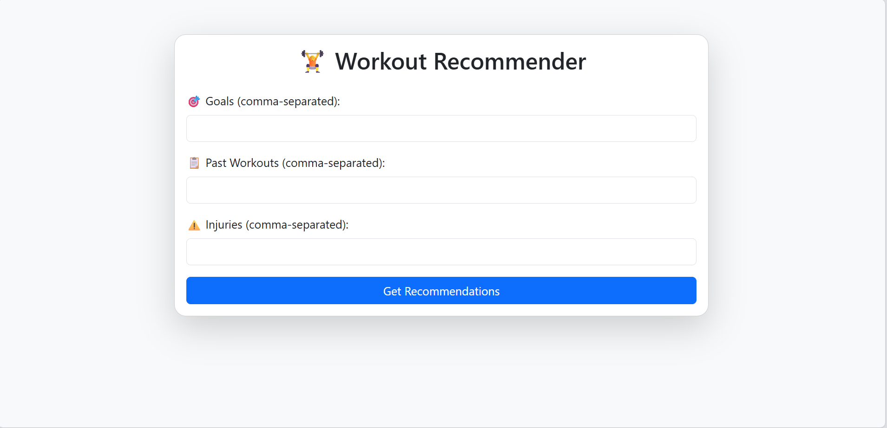
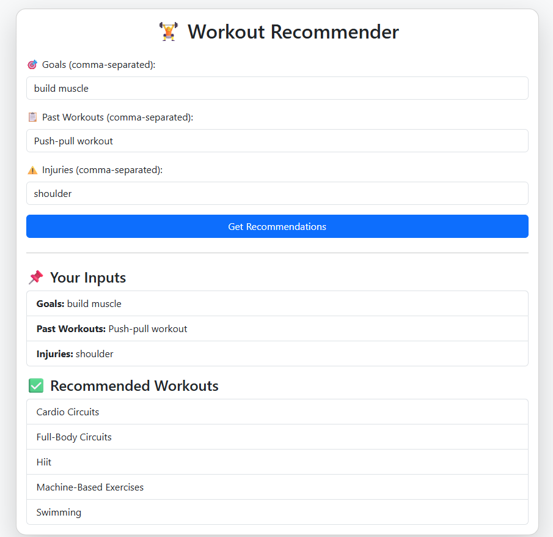

# 🏋️‍♂️ Personalized Workout Planner

A simple rule-based system that recommends personalized workout plans based on user goals, workout history, and existing injuries.

---

## 📌 Project Overview

This project uses a **Rule-Based Recommendation System** to generate suitable workout suggestions for each user based on:

-  **Goals** (e.g., lose weight, build muscle)
- **Past workouts**
-  **Injuries or health conditions**

---

## 🧠 Sample User Data

```json
{
  "user_id": 1,
  "goal": "lose weight",
  "past_workouts": ["cardio", "hiit"],
  "injuries": ["knee"]
}
```

---

## 🗂️ Project Structure

```
Workout-Recommender/
│
├── app.py                # Flask web application
├── recommender.py        # Rule-based recommendation logic
├── user.json             # Sample user data
│
├── templates/
│   └── index.html        # Main Bootstrap UI
│
└── README.md             # Project documentation
```

---

## 💻 How to Run Locally

### 1️⃣ Clone the Repository

```bash
git clone https://github.com/ahmedmazoon/personalized-workout-planner.git
cd personalized-workout-planner
```

### 2️⃣ Install Dependencies

```bash
pip install flask
```

### 3️⃣ Run the Flask App

```bash
python app.py
```

---

## 🎥 Web Demo

📺 **Interactive User Interface:**

▶️ [Watch Demo Video](https://drive.google.com/file/d/1wtC2V7snp0X5jTs77S9K8pw8l-Q4ISyh/view?usp=sharing)

---

## 🧪 Example Console Output

```text
User 1 Recommendation:
 - Push-Pull Workout
 - Full-Body Circuits
 - Hiit
 - Machine-Based Exercises
 - Swimming

User 2 Recommendation:
 - Cardio Circuits
 - Push-Pull Workout
 - Full-Body Circuits
 - Hiit
 - Machine-Based Exercises

User 3 Recommendation:
 - Cardio Circuits
 - Push-Pull Workout
 - Full-Body Circuits
 - Hiit
 - Machine-Based Exercises
```

---

## 🖼️ Web Deployment Preview

### 🏠 Home Page
<p align="center">  
    
</p>

### ✅ Web Output
<p align="center">  
    
</p>

---

## 📊 Scoring Logic

Each workout suggestion is scored based on how well it matches the user's profile:

| **Criterion**                     | **Points** |
|----------------------------------|------------|
| Matches user's fitness goal      | +2         |
| Found in past workouts           | +1         |
| Does **not** aggravate injury    | +1         |
| **Maximum Score per workout**    | **4**      |

### 🧮 Example 1

**Workout:** `HIIT`  
**User Goal:** `lose weight` ✅ → +2  
**Past Workouts:** `["cardio", "hiit"]` ✅ → +1  
**Injury (knee):** `HIIT` is safe ✅ → +1  
**Total Score:** **4**

### 🧮 Example 2

**Workout:** `Squats`  
**User Goal:** `build muscle` ✅ → +2  
**Past Workouts:** `["cardio"]` ❌ → +0  
**Injury (knee):** `Squats` may cause strain ❌ → +0  
**Total Score:** **2**

---

### 📝 Notes:

- Workouts are **ranked by score**: higher-scoring exercises appear first in the final recommendations.
- The system **excludes** any workouts that conflict with reported injuries.
- If multiple workouts have the same score, they’re grouped together without a specific order.
- The scoring rules are **customizable** and can be extended later (e.g., to include fitness level or available equipment).
- This logic ensures that recommendations are both **goal-oriented** and **injury-aware**, even without machine learning.

---

## ✅ Features

-  Rule-Based Workout Recommendations  
-  Reads user preferences from a JSON file  
-  Scores each workout suggestion based on relevance  
-  Flask web interface with Bootstrap styling  
-  Dynamic display of personalized workout plans  
-  Injury-aware suggestions (avoids harmful exercises)  
-  Console + Web output for testing and validation 
---
## 👨‍💻 Developer

- **Ahmed Mazoon**
- [GitHub Profile](https://github.com/ahmedmazoon)

---
